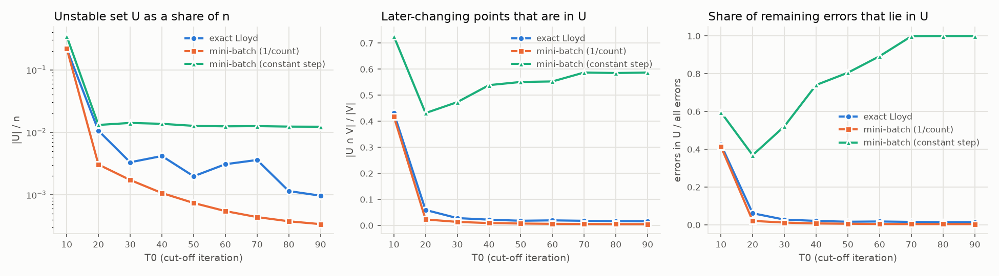
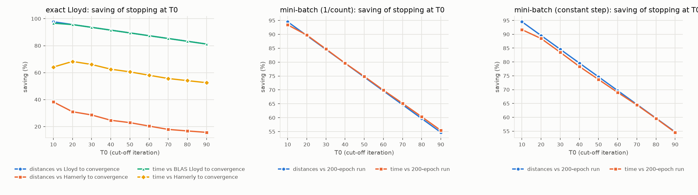
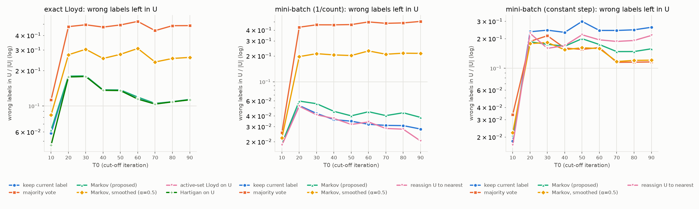
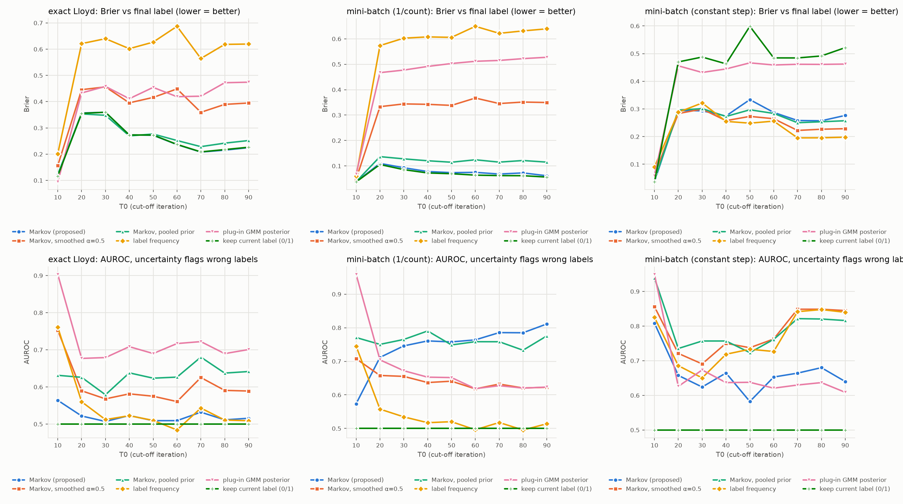
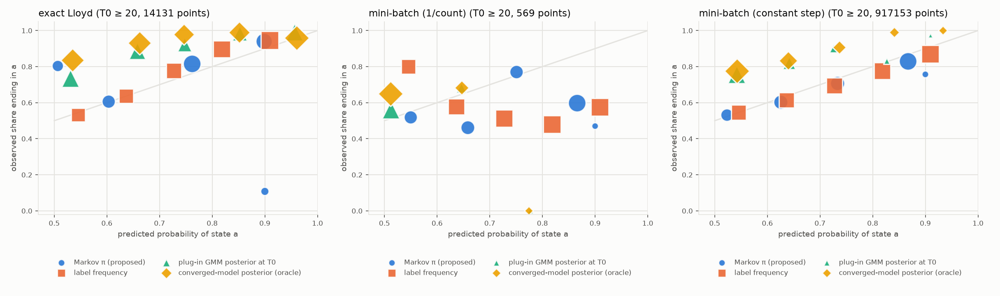

# 실험 결과: 비수렴 벡터의 Markov 연쇄 기반 편입

> * 이 문서의 표는 결과 CSV에서 자동으로 다시 채운다.
>   * 1–5절: `python -m experiments.analyze_markov_tail`
>   * 6–8절: `python -m experiments.analyze_applications`
> * 패키지: `pip install markov-kmeans`. 6절의 자동 판단 규칙은 0.2.0부터 기본값이다.

## 0. 한눈에 보기

제안 알고리즘(이하 **MK**)의 절차:
1. K-means를 T₀회 돌린 뒤, 최근 W=10회 사이에 라벨이 바뀐 점(비수렴 집합 U)만 고른다.
2. U의 점마다 클러스터 주소 이력으로 전이행렬을 만든다.
3. Markov 연쇄의 장기 분포 π로 편입한다.
   * hard: argmax π
   * soft: π 자체를 소속도로 사용

| 질문 | 답 |
|---|---|
| **RQ1 계산량** | T₀에서 멈추면 Lloyd를 끝까지 돌리는 것보다 거리 계산을 81–98% 줄인다. 더 강한 기준선인 Hamerly 가속 정확법과 비교하면 시간 52–68%(N=3×10⁷에서는 73–84%)를 줄인다. **절감은 "멈춤"에서 나온다.** Markov 편입 자체는 T₀≥20에서 0.3–1.3초로, Hamerly 반복 약 1회 비용이다. |
| **RQ2 오차** | MK-hard의 U 내부 오류는 "현재 라벨 유지"와 거의 같다(정확 Lloyd +0–0.2%p, 1/count mini-batch +0.5–1.3%p). 다수결은 크게 나쁘다(U의 43–53%). 남은 오류의 대부분은 **U 밖**, 즉 T₀에 안정해 보이던 점에서 나온다(앞으로 바뀔 점 중 U에 있는 비율 0.3–8.5%). 예외는 영구 진동(상수 스텝) 체제로, 여기서는 MK(15–20%)와 다수결(11–21%)이 유지(23–30%)보다 U 오류가 작다. |
| **RQ3 연속 해석** | 체제에 따라 갈린다. 정확 Lloyd와 1/count mini-batch에서는 분수형 π(U의 0.2–9%)를 받은 점도 결국 한 군집에 정착한다(장기적으로 섞이는 비율 0–2%). 여기서 π는 "소속 비율"이 아니라 "아직 미결정"의 신호다. mini-batch에서는 틀릴 점 탐지 AUROC 0.71–0.98로 GMM 사후(0.60–0.75)보다 낫다. **영구 진동 체제에서는 분수형 π가 U의 82–94%이고, 그중 80%가 실제로 장기간 두 군집을 오간다.** 여기서는 π가 실제 소속 비율로 보정돼 있다(예측 0.55→관측 0.53, 0.85→0.83). 다만 단순 창 빈도도 같은 수준이다. |
| **자동 판단 (6절)** | 움직이는 점의 비율, 대표점·분할의 안정성을 보고 개입 시점과 편입 방식을 고르는 규칙을 넣었다. N=10⁶ 10개 사례에서 끝까지 돌린 시간의 7–81%만 쓰고 오류율 0.05–0.62%를 낸다. 상수 스텝에서는 sklearn식 규칙이 전혀 멈추지 못하는 반면, 이 규칙은 7–68% 시점에서 멈추고 끝까지 돌린 결과와 비슷한 오류를 낸다. |
| **응용 (7–8절)** | 고해상도 사진 색 양자화와 EMA VQ 코드북(이미지 토크나이저)에 적용했다. 결과는 7–8절에 있다. |

## 1. 실험 설정

### 1.1 데이터와 사례 선택

* **데이터:** 합성 등방 가우시안 혼합(`datasets.gmm`). 참 성분 수 = k, 단위 분산, 성분 평균 ~ N(0, sep²I).
* **사례 선택:** 기준 궤적이 **수렴까지 100회 이상** 걸린 사례만 남긴다(연구 요청 조건).
* **초기화:** k-means++(scikit-learn `kmeans_plusplus`). 같은 사례의 모든 전략은 같은 초기값을 쓴다.
* **사례 묶음:**
  * main: N=10⁷, d=16
  * highdim: N=2×10⁶, d=128
  * extreme: N=3×10⁷, d=16
  * 2–5절의 표와 그림은 main 묶음이다. 나머지는 2.1절과 5.2절에 따로 정리했다.

<!-- TABLE:instances -->
| # | regime | group | n | d | k | sep | seed | T_conv | acc |
|---|---|---|---|---|---|---|---|---|---|
| 1 | exact | main | 10,000,000 | 16 | 100 | 1.5 | 0 | 444 | 0.946 |
| 2 | exact | main | 10,000,000 | 16 | 100 | 1.5 | 1 | 614 | 0.919 |
| 3 | exact | main | 10,000,000 | 16 | 100 | 2.0 | 0 | 619 | 0.923 |
| 4 | exact | main | 10,000,000 | 16 | 100 | 2.0 | 1 | 406 | 0.953 |
| 5 | exact | main | 10,000,000 | 16 | 50 | 1.5 | 0 | 389 | 0.872 |
| 6 | exact | main | 10,000,000 | 16 | 50 | 1.5 | 1 | 383 | 0.868 |
| 7 | exact | main | 10,000,000 | 16 | 50 | 2.0 | 0 | 768 | 0.909 |
| 8 | exact | main | 10,000,000 | 16 | 50 | 2.0 | 1 | 471 | 0.939 |
| 9 | exact | highdim | 2,000,000 | 128 | 50 | 0.5 | 0 | 150 | 0.967 |
| 10 | exact | highdim | 2,000,000 | 128 | 50 | 0.7 | 0 | 460 | 0.940 |
| 11 | exact | extreme | 30,000,000 | 16 | 50 | 2.0 | 0 | 559 | 0.939 |
| 12 | minibatch | main | 10,000,000 | 16 | 100 | 1.5 | 0 | 200 | 0.913 |
| 13 | minibatch | main | 10,000,000 | 16 | 100 | 2.0 | 0 | 200 | 0.923 |
| 14 | minibatch | main | 10,000,000 | 16 | 50 | 1.5 | 0 | 200 | 0.812 |
| 15 | minibatch | main | 10,000,000 | 16 | 50 | 2.0 | 0 | 200 | 0.908 |
| 16 | minibatch | highdim | 2,000,000 | 128 | 50 | 0.5 | 0 | 200 | 0.968 |
| 17 | minibatch | highdim | 2,000,000 | 128 | 50 | 0.7 | 0 | 200 | 0.882 |
| 18 | minibatch_const | main | 10,000,000 | 16 | 50 | 1.5 | 0 | 200 | 0.872 |
<!-- /TABLE -->

(`acc`는 수렴해의 참 성분 대비 정확도다. Hungarian 매칭으로 계산했다.)

### 1.2 세 가지 체제 (라벨 이력을 만드는 기반 알고리즘)

| 체제 | 반복 1회 | 기준해(reference) | 비고 |
|---|---|---|---|
| **exact** | Lloyd 1회. 같은 궤적을 내는 Hamerly 가속법으로 실행 | 라벨 변화 0까지 수렴한 해 | 정확 Lloyd는 유한 번 안에 반드시 수렴한다(Selim & Ismail 1984). 비수렴은 "긴 꼬리"다. |
| **minibatch** | epoch 1회. Sculley(2010), 배치 4096, 학습률 1/count | 마지막 50 epoch(151–200)의 최빈 라벨. soft 기준은 그 기간의 점유율 | 진동이 점점 줄어든다. |
| **minibatch_const** | epoch 1회, 고정 학습률 η=2×10⁻⁴ | 동일 | 대표점이 계속 흔들려 극소수 점이 **영구히 진동**한다. 연속 해석에 가장 유리한 조건이다. EMA로 갱신하는 VQ 코드북(8절)이 같은 구조다. |

### 1.3 비교 방법 (모두 T₀의 같은 상태에서 출발)

* **공통 출발 상태:** T₀ 시점 라벨 L과 대표점 C_T₀, 그리고 U의 라벨 창(W=10).
* **비수렴 집합 U:** [T₀−10, T₀] 사이에 라벨이 한 번이라도 바뀐 점.
* **대표점 처리:** exact 체제는 출력 대표점을 결과 라벨의 중심으로 한 번 다시 계산한다. mini-batch 체제는 T₀ 시점 대표점을 그대로 쓴다.

| ID | 방법 | 추가 비용 |
|---|---|---|
| B1 `stop` | T₀에서 멈추고 현재 라벨 유지 (Pérez-Ortega 계열 조기 종료와 같은 처리) | 0 |
| B2 `reassign_U` | U만 가장 가까운 대표점에 재배정 | \|U\|·k 거리 |
| B3 `majority` | 창 안의 최빈 라벨 | 0 |
| B4 `active_set_U` | 안정점은 고정하고 U에만 Lloyd 반복 (exact만) | \|U\|·k × 반복 |
| B5 `hartigan_U` | U에만 Hartigan 단일점 이동 (exact만) | \|U\|·k × 스윕 |
| `reassign_all` | 모든 점을 T₀ 대표점에 재배정 (mini-batch만) | N·k 거리 |
| **P1 `markov`** | **제안법(hard).** 평활 없음. 출력 전이가 없는 마지막 상태는 자기전이로 둔다. 장기 분포는 Cesàro 극한(게으른 연쇄 (I+P)/2의 극한)으로 계산 | 0 거리, \|U\|·W 연산 |
| **P2 `markov_soft`** | **제안법(soft).** π를 소속도로 쓰고, 대표점은 가중평균 | 동일 |
| 변형 | `markov_a0.5`(Dirichlet 평활 α=0.5), `markov_pooled`(클러스터 쌍별 전이를 모은 공유 사전분포), `markov_w5` / `markov_w20`(창 길이) | 동일 |
| soft 비교군 | `frequency_soft`(창 안 라벨 빈도), `gmm_plugin_soft`(T₀ 대표점의 plug-in GMM 사후), `fcm_soft`(fuzzy c-means, m=2) | \|U\|·k 거리 |
| 기준 | `full_convergence`(끝까지 수렴), `true_posterior_oracle`, `model_posterior_oracle`(수렴 모형의 사후 — 미래 정보를 쓴 oracle) | – |

### 1.4 지표

* **계산량:** 점–대표점 거리 계산 횟수(구현과 무관), 단일 스레드 벽시계 시간. 비교 대상은 셋이다:
  * Lloyd를 끝까지: (T_conv+1)·N·k 거리. 시간은 BLAS(GEMM) Lloyd 1회 실측값 × 반복 수
  * Hamerly를 끝까지: 실측
  * mini-batch 200 epoch: 실측
* **오차:**
  * 기준해 대비 라벨 불일치율(전체)
  * **U 내부 오류율.** 전체 불일치에서 U 밖 불일치를 뺀 값을 \|U\|로 나눈다. U 밖 불일치는 B1과 모든 U-전용 방법에서 같다.
  * 상대 SSE, 대표점 오차(평균 최근접 대표점 거리로 정규화), 참 성분 대비 정확도
* **연속 해석:**
  * Brier(최종 라벨 대비)
  * AUROC: 불확실도 1−max π로 최종 라벨과 다른 점을 얼마나 잘 가려내는가
  * 분수형 π 비율
  * mini-batch: 장기 점유율과의 TV 거리
  * 점별 신뢰도 분석(`experiments/oscillators.py`): π(a)로 예측한 확률과 실제로 a에 정착한 비율을 비교한다.
  * \|U\|가 20만을 넘는 T₀(주로 10)에서는 soft 지표만 U의 시드 고정 무작위 표본 20만 개로 계산했다(`n_U_eval` 열).
* **환경:** 4 CPU, 15 GB RAM. 일반 Lloyd와 Hamerly는 단일 스레드, numba 0.68, NumPy 2.4.

## 2. 현상: T₀별 비수렴 집합



**exact (일반 Lloyd)**

<!-- TABLE:exact_state -->
| T0 | \|U\|/n | \|U\| 평균 | T0 이후 바뀌는 점 \|V\| | \|U∩V\|/\|V\| | U 중 T0 라벨이 틀린 점 | 전체 오류율(유지) |
|---|---|---|---|---|---|---|
| 10 | 21.771% | 2,177,132 | 331,948 | 48.0% | 140,821 | 2.984% |
| 20 | 1.059% | 105,932 | 247,049 | 8.5% | 20,045 | 2.226% |
| 30 | 0.331% | 33,070 | 221,351 | 3.3% | 6,900 | 2.022% |
| 40 | 0.417% | 41,689 | 184,046 | 2.4% | 4,015 | 1.692% |
| 50 | 0.198% | 19,757 | 167,097 | 1.7% | 2,468 | 1.543% |
| 60 | 0.308% | 30,812 | 139,443 | 2.3% | 2,819 | 1.288% |
| 70 | 0.360% | 36,011 | 105,215 | 1.7% | 1,477 | 0.970% |
| 80 | 0.114% | 11,448 | 95,109 | 1.4% | 1,070 | 0.876% |
| 90 | 0.097% | 9,655 | 86,632 | 1.4% | 956 | 0.799% |
<!-- /TABLE -->

**minibatch (1/count)**

<!-- TABLE:minibatch_state -->
| T0 | \|U\|/n | \|U\| 평균 | T0 이후 바뀌는 점 \|V\| | \|U∩V\|/\|V\| | U 중 T0 라벨이 틀린 점 | 전체 오류율(유지) |
|---|---|---|---|---|---|---|
| 10 | 22.030% | 2,202,976 | 107,412 | 61.0% | 60,430 | 1.002% |
| 20 | 0.305% | 30,455 | 80,844 | 4.8% | 3,529 | 0.739% |
| 30 | 0.172% | 17,234 | 65,340 | 2.6% | 1,524 | 0.585% |
| 40 | 0.106% | 10,648 | 55,676 | 1.8% | 844 | 0.489% |
| 50 | 0.074% | 7,379 | 48,942 | 1.3% | 546 | 0.422% |
| 60 | 0.055% | 5,472 | 43,921 | 1.0% | 366 | 0.372% |
| 70 | 0.044% | 4,389 | 39,860 | 0.8% | 263 | 0.331% |
| 80 | 0.038% | 3,759 | 36,368 | 0.7% | 214 | 0.296% |
| 90 | 0.034% | 3,384 | 33,202 | 0.7% | 164 | 0.264% |
<!-- /TABLE -->

**minibatch_const (고정 학습률)**

<!-- TABLE:minibatch_const_state -->
| T0 | \|U\|/n | \|U\| 평균 | T0 이후 바뀌는 점 \|V\| | \|U∩V\|/\|V\| | U 중 T0 라벨이 틀린 점 | 전체 오류율(유지) |
|---|---|---|---|---|---|---|
| 10 | 34.547% | 3,454,734 | 283,159 | 72.7% | 62,559 | 1.049% |
| 20 | 1.310% | 130,992 | 267,682 | 43.2% | 30,771 | 0.834% |
| 30 | 1.411% | 141,115 | 240,423 | 47.4% | 34,401 | 0.659% |
| 40 | 1.366% | 136,609 | 225,100 | 53.9% | 31,626 | 0.427% |
| 50 | 1.267% | 126,730 | 219,069 | 55.1% | 37,927 | 0.471% |
| 60 | 1.244% | 124,404 | 211,780 | 55.3% | 30,134 | 0.338% |
| 70 | 1.255% | 125,468 | 209,195 | 58.7% | 30,382 | 0.304% |
| 80 | 1.232% | 123,197 | 207,357 | 58.5% | 30,273 | 0.303% |
| 90 | 1.227% | 122,680 | 205,195 | 58.7% | 31,991 | 0.320% |
<!-- /TABLE -->

**관찰**

* **U는 극소수다.** T₀≥20부터 U는 N의 0.1–1%(exact), 0.03–0.3%(1/count mini-batch)다. "극소수 비수렴 벡터" 전제가 성립한다. 상수 스텝에서는 1.2–1.4%에서 줄지 않는다.
* **그러나 앞으로 바뀔 점(V)의 대부분은 U 밖에 있다.** T₀≥20에서 U가 미리 잡아내는 비율 \|U∩V\|/\|V\|는 exact 1.4–8.5%, 1/count mini-batch 0.7–4.8%다.
  * 정확 Lloyd의 남은 변화는 대표점이 조금씩 움직이며 경계가 **새로운 점**을 넘어가는 과정이다.
  * T₀ 이전에 흔들린 점이 계속 흔들리는 과정이 아니다.
  * 상수 스텝에서는 반대로 43–59%를 잡는다. 같은 점들이 계속 오가기 때문이다.
* **N=10⁷에서는 꼬리가 길고 굵다.** 수렴까지 383–768회가 걸렸고, T₀=90에서도 전체의 0.8%가 최종 라벨과 다르다. T₀=60–70 무렵에는 연쇄적 재배치(한 반복에 수천~수만 점 이동)도 관찰된다.

### 2.1 고차원(d=128)과 극대 규모(N=3×10⁷)

같은 지표를 묶음별로 요약했다(T₀별, 사례 평균).

**highdim — exact**

<!-- TABLE:highdim_exact -->
| T0 | \|U\|/n | \|U∩V\|/\|V\| | 거리 절감 vs Lloyd | 시간 절감 vs Hamerly | U 오류: 유지 | U 오류: Markov | U 오류: 다수결 | 분수형 π 비율 | AUROC Markov soft | AUROC GMM |
|---|---|---|---|---|---|---|---|---|---|---|
| 10 | 51.972% | 77.1% | 95.2% | 49.2% | 2.8% | 2.9% | 3.7% | 2.5% | 0.592 | 0.918 |
| 20 | 0.498% | 5.5% | 90.8% | 49.3% | 20.6% | 21.0% | 48.5% | 2.9% | 0.529 | 0.725 |
| 30 | 1.584% | 7.1% | 86.4% | 37.2% | 10.7% | 10.8% | 26.1% | 1.8% | 0.541 | 0.828 |
| 40 | 0.113% | 6.0% | 82.0% | 35.7% | 18.0% | 18.2% | 46.9% | 2.6% | 0.525 | 0.688 |
| 50 | 0.080% | 5.7% | 77.6% | 34.1% | 23.1% | 23.0% | 43.9% | 3.0% | 0.524 | 0.671 |
| 60 | 0.050% | 3.8% | 73.2% | 32.6% | 20.0% | 20.2% | 48.1% | 3.3% | 0.528 | 0.652 |
| 70 | 0.050% | 3.5% | 68.8% | 31.1% | 15.5% | 15.6% | 57.1% | 1.8% | 0.516 | 0.728 |
| 80 | 0.058% | 4.1% | 64.4% | 29.6% | 13.6% | 13.9% | 46.5% | 2.4% | 0.565 | 0.739 |
| 90 | 0.048% | 4.1% | 60.0% | 28.1% | 15.7% | 15.9% | 50.7% | 2.6% | 0.533 | 0.730 |
<!-- /TABLE -->

**highdim — minibatch**

<!-- TABLE:highdim_minibatch -->
| T0 | \|U\|/n | \|U∩V\|/\|V\| | 시간 절감 vs 200 epoch | U 오류: 유지 | U 오류: Markov | U 오류: 다수결 | 분수형 π 비율 | AUROC Markov soft | AUROC GMM |
|---|---|---|---|---|---|---|---|---|---|
| 10 | 51.491% | 54.6% | 93.2% | 0.4% | 0.5% | 0.7% | 1.0% | 0.589 | 0.992 |
| 20 | 0.085% | 1.0% | 89.7% | 1.8% | 2.3% | 39.4% | 4.8% | 0.809 | 0.597 |
| 30 | 0.042% | 0.5% | 84.7% | 0.9% | 2.1% | 43.1% | 4.8% | 0.929 | 0.614 |
| 40 | 0.029% | 0.5% | 79.9% | 1.5% | 2.5% | 44.7% | 5.1% | 0.821 | 0.665 |
| 50 | 0.020% | 0.4% | 75.1% | 1.0% | 2.3% | 43.5% | 4.2% | 0.957 | 0.751 |
| 60 | 0.016% | 0.4% | 70.2% | 1.2% | 3.0% | 42.9% | 8.7% | 0.968 | 0.676 |
| 70 | 0.013% | 0.4% | 65.3% | 1.1% | 3.3% | 46.5% | 7.5% | 0.983 | 0.700 |
| 80 | 0.011% | 0.3% | 60.0% | 1.0% | 2.5% | 45.1% | 6.7% | 0.979 | 0.720 |
| 90 | 0.010% | 0.4% | 54.8% | 0.7% | 3.0% | 49.6% | 7.3% | 0.971 | 0.740 |
<!-- /TABLE -->

**extreme (N=3×10⁷) — exact**

<!-- TABLE:extreme_exact -->
| T0 | \|U\|/n | \|U∩V\|/\|V\| | 거리 절감 vs Lloyd | 시간 절감 vs Hamerly | U 오류: 유지 | U 오류: Markov | U 오류: 다수결 | 분수형 π 비율 | AUROC Markov soft | AUROC GMM |
|---|---|---|---|---|---|---|---|---|---|---|
| 10 | 7.081% | 31.7% | 98.0% | 81.7% | 4.4% | 4.4% | 4.8% | 2.2% | 0.499 | 0.965 |
| 20 | 0.077% | 0.8% | 96.2% | 84.4% | 8.5% | 8.4% | 48.8% | 0.5% | 0.513 | 0.755 |
| 30 | 0.076% | 1.0% | 94.5% | 82.7% | 9.7% | 9.7% | 49.0% | 0.2% | 0.506 | 0.720 |
| 40 | 0.068% | 0.9% | 92.7% | 81.2% | 9.8% | 9.8% | 50.7% | 0.3% | 0.509 | 0.718 |
| 50 | 0.067% | 1.0% | 90.9% | 79.5% | 10.1% | 10.1% | 47.7% | 0.2% | 0.504 | 0.710 |
| 60 | 0.060% | 1.0% | 89.1% | 77.9% | 10.6% | 10.6% | 49.6% | 0.2% | 0.504 | 0.717 |
| 70 | 0.055% | 1.0% | 87.3% | 76.2% | 11.0% | 11.1% | 48.3% | 0.3% | 0.506 | 0.692 |
| 80 | 0.052% | 1.0% | 85.5% | 74.6% | 11.4% | 11.4% | 49.0% | 0.3% | 0.507 | 0.694 |
| 90 | 0.050% | 1.2% | 83.8% | 73.0% | 12.3% | 12.3% | 50.4% | 0.4% | 0.506 | 0.700 |
<!-- /TABLE -->

* **규모가 커져도 결론은 같다.** N=3×10⁷에서 U는 N의 0.05–0.08%이고, 앞으로 바뀔 점 중 U에 있는 비율은 0.8–1.2%에 그친다. Hamerly 대비 시간 절감은 73–84%로 N=10⁷보다 크다.
* **고차원에서도 같다.** d=128에서 Markov의 U 오류는 유지보다 exact +0–0.4%p, mini-batch +0.5–2.3%p이고, 다수결은 T₀≥20에서 26–57%를 틀린다.
* **차이 하나:** d=128 mini-batch에서는 Markov soft의 틀릴 점 탐지 AUROC가 0.81–0.98로 매우 높다(GMM 0.60–0.75). 반대로 exact에서는 GMM 사후가 낫다(0.65–0.83 대 0.52–0.57).

## 3. RQ1 — 계산량



**exact**

<!-- TABLE:exact_compute -->
| T0 | 거리 절감 vs Lloyd | 시간 절감 vs BLAS Lloyd | 거리 절감 vs Hamerly | 시간 절감 vs Hamerly | Markov 추가 시간(초) |
|---|---|---|---|---|---|
| 10 | 97.7% | 96.7% | 38.3% | 64.1% | 22.24 |
| 20 | 95.7% | 95.6% | 31.0% | 68.3% | 1.16 |
| 30 | 93.6% | 93.6% | 28.6% | 66.0% | 0.52 |
| 40 | 91.5% | 91.5% | 24.7% | 62.5% | 0.58 |
| 50 | 89.5% | 89.4% | 22.9% | 60.6% | 0.37 |
| 60 | 87.4% | 87.4% | 20.4% | 58.1% | 0.48 |
| 70 | 85.3% | 85.3% | 17.9% | 55.6% | 0.57 |
| 80 | 83.3% | 83.2% | 16.7% | 54.1% | 0.31 |
| 90 | 81.2% | 81.2% | 15.7% | 52.5% | 0.28 |
<!-- /TABLE -->

**minibatch**

<!-- TABLE:minibatch_compute -->
| T0 | 거리 절감 vs 200 epoch | 시간 절감 vs 200 epoch | Markov 추가 시간(초) |
|---|---|---|---|
| 10 | 94.5% | 93.4% | 21.59 |
| 20 | 89.6% | 89.7% | 0.27 |
| 30 | 84.6% | 84.7% | 0.17 |
| 40 | 79.6% | 79.6% | 0.11 |
| 50 | 74.6% | 74.9% | 0.09 |
| 60 | 69.7% | 69.9% | 0.07 |
| 70 | 64.7% | 65.2% | 0.06 |
| 80 | 59.7% | 60.3% | 0.05 |
| 90 | 54.7% | 55.4% | 0.05 |
<!-- /TABLE -->

**minibatch_const**

<!-- TABLE:minibatch_const_compute -->
| T0 | 거리 절감 vs 200 epoch | 시간 절감 vs 200 epoch | Markov 추가 시간(초) |
|---|---|---|---|
| 10 | 94.5% | 91.7% | 38.17 |
| 20 | 89.6% | 88.5% | 1.26 |
| 30 | 84.6% | 83.5% | 1.19 |
| 40 | 79.6% | 78.4% | 1.40 |
| 50 | 74.6% | 73.7% | 1.01 |
| 60 | 69.7% | 69.0% | 1.08 |
| 70 | 64.7% | 64.5% | 1.12 |
| 80 | 59.7% | 59.6% | 1.58 |
| 90 | 54.7% | 54.6% | 1.05 |
<!-- /TABLE -->

**해석**

1. **어떤 기준선과 비교하는지가 결정적이다.**
   * Lloyd 대비 절감(81–98%)은 크다.
   * N=10⁷에서 Hamerly는 반복 1회에 평균 0.3–0.7초로, BLAS Lloyd(3.5–6.2초)보다 약 10배 싸다. 그래서 Hamerly 대비 **거리 계산** 절감은 16–38%에 그친다.
   * 반면 Hamerly도 반복마다 N개 점 전체의 상·하한을 갱신해야 하므로, **시간** 절감은 52–68%로 더 크다.
2. **절감의 원천은 "T₀에서 멈춤"이다.**
   * Markov 편입 자체는 거리를 계산하지 않는다.
   * 다만 \|U\|·W 크기의 연쇄 계산과 대표점 1회 갱신이 든다. T₀=10(U가 N의 22%)에서는 약 22초로 커지지만, T₀≥20에서는 0.3–1.2초로 Hamerly 반복 약 1회다.
   * 따라서 계산량 면에서 MK는 B1(그냥 멈춤)과 같은 이득을 얻고, 거기에 작은 비용을 더한다.
3. **mini-batch는 기준해 자체가 "200 epoch"라는 임의의 지평이다.** 절감률은 (200−T₀)/200에 가깝다. 언제 멈출지를 상태로 판단하는 규칙은 6절에서 다룬다.

## 4. RQ2 — 오차



**U 내부 오류율 (U 중 최종 라벨과 다른 비율) — exact**

<!-- TABLE:exact_uerr -->
| T0 | 유지(B1) | 다수결(B3) | **Markov(P1)** | Markov α=0.5 | Markov+공유사전(P3) | U 재배정(B2) | U만 Lloyd(B4) | U만 Hartigan(B5) |
|---|---|---|---|---|---|---|---|---|
| 10 | 5.85% | 11.25% | 6.23% | 8.36% | 6.34% | 5.56% | 4.62% | 4.62% |
| 20 | 17.79% | 47.54% | 17.97% | 27.34% | 19.92% | 17.69% | 17.68% | 17.68% |
| 30 | 17.99% | 49.31% | 18.05% | 30.48% | 20.51% | 17.87% | 17.84% | 17.83% |
| 40 | 13.66% | 47.11% | 13.73% | 25.42% | 15.86% | 13.61% | 13.60% | 13.60% |
| 50 | 13.64% | 49.15% | 13.70% | 27.58% | 16.62% | 13.56% | 13.53% | 13.52% |
| 60 | 11.85% | 52.68% | 11.90% | 30.95% | 14.83% | 11.51% | 11.45% | 11.44% |
| 70 | 10.43% | 43.95% | 10.52% | 23.71% | 13.57% | 10.40% | 10.39% | 10.37% |
| 80 | 10.87% | 48.42% | 10.87% | 25.43% | 13.76% | 10.84% | 10.83% | 10.83% |
| 90 | 11.32% | 48.50% | 11.38% | 25.97% | 14.74% | 11.28% | 11.28% | 11.28% |
<!-- /TABLE -->

**전체 라벨 불일치율 — exact**

<!-- TABLE:exact_err -->
| T0 | 유지(B1) | 다수결(B3) | **Markov(P1)** | Markov α=0.5 | Markov+공유사전(P3) | U 재배정(B2) | U만 Lloyd(B4) | U만 Hartigan(B5) |
|---|---|---|---|---|---|---|---|---|
| 10 | 2.984% | 4.343% | 3.069% | 3.575% | 3.090% | 2.900% | 2.597% | 2.597% |
| 20 | 2.226% | 2.568% | 2.230% | 2.297% | 2.240% | 2.225% | 2.224% | 2.224% |
| 30 | 2.022% | 2.119% | 2.022% | 2.061% | 2.027% | 2.021% | 2.021% | 2.021% |
| 40 | 1.692% | 1.828% | 1.692% | 1.723% | 1.697% | 1.691% | 1.691% | 1.691% |
| 50 | 1.543% | 1.617% | 1.543% | 1.572% | 1.548% | 1.542% | 1.542% | 1.542% |
| 60 | 1.288% | 1.466% | 1.288% | 1.402% | 1.293% | 1.283% | 1.283% | 1.283% |
| 70 | 0.970% | 1.024% | 0.971% | 0.992% | 0.975% | 0.969% | 0.969% | 0.969% |
| 80 | 0.876% | 0.920% | 0.876% | 0.893% | 0.879% | 0.876% | 0.876% | 0.876% |
| 90 | 0.799% | 0.836% | 0.799% | 0.813% | 0.802% | 0.799% | 0.799% | 0.799% |
<!-- /TABLE -->

**U 내부 오류율 — minibatch**

<!-- TABLE:minibatch_uerr -->
| T0 | 유지(B1) | 다수결(B3) | **Markov(P1)** | Markov α=0.5 | Markov+공유사전(P3) | U 재배정(B2) |
|---|---|---|---|---|---|---|
| 10 | 1.85% | 2.55% | 1.91% | 2.22% | 1.93% | 1.82% |
| 20 | 5.28% | 43.20% | 5.95% | 19.61% | 7.10% | 5.19% |
| 30 | 4.27% | 46.06% | 5.55% | 21.24% | 6.79% | 4.12% |
| 40 | 3.62% | 46.02% | 4.52% | 20.54% | 6.41% | 3.74% |
| 50 | 3.47% | 46.34% | 4.01% | 20.19% | 5.45% | 3.18% |
| 60 | 3.19% | 49.77% | 4.47% | 22.87% | 6.54% | 3.40% |
| 70 | 3.10% | 47.95% | 4.03% | 20.92% | 5.70% | 2.86% |
| 80 | 3.08% | 48.46% | 4.35% | 21.51% | 6.26% | 2.80% |
| 90 | 2.81% | 50.47% | 3.84% | 21.41% | 5.23% | 2.04% |
<!-- /TABLE -->

**U 내부 오류율 — minibatch_const**

<!-- TABLE:minibatch_const_uerr -->
| T0 | 유지(B1) | 다수결(B3) | **Markov(P1)** | Markov α=0.5 | Markov+공유사전(P3) | U 재배정(B2) |
|---|---|---|---|---|---|---|
| 10 | 1.81% | 3.38% | 2.10% | 2.21% | 2.29% | 1.65% |
| 20 | 23.49% | 18.74% | 18.58% | 17.79% | 18.64% | 22.67% |
| 30 | 24.38% | 21.39% | 17.51% | 18.26% | 19.29% | 15.92% |
| 40 | 23.15% | 16.04% | 16.75% | 15.41% | 16.54% | 16.97% |
| 50 | 29.93% | 15.54% | 19.96% | 16.17% | 17.36% | 21.89% |
| 60 | 24.22% | 16.23% | 17.42% | 15.84% | 16.84% | 19.43% |
| 70 | 24.21% | 11.48% | 14.76% | 11.69% | 12.62% | 18.73% |
| 80 | 24.57% | 11.52% | 14.78% | 12.01% | 13.04% | 19.14% |
| 90 | 26.08% | 11.58% | 15.76% | 12.07% | 13.27% | 21.53% |
<!-- /TABLE -->

**해석**

1. **MK-hard ≈ B1 (정확 Lloyd, 1/count mini-batch).**
   * U 내부 오류는 B1과 같거나 조금 높다(exact 0–0.2%p, mini-batch 0.5–1.3%p).
   * 이유: 이 체제의 비수렴 점은 대부분 "한 번 옮겨 가서 머문" 흡수형 이력을 가진다. 그래서 정상분포가 현재 라벨에 1을 준다.
   * 진동형 이력(A B A B)에서는 정상분포가 0.5/0.5가 되고, 동점이면 현재 라벨을 택하도록 했다. 결국 대부분의 경우 MK-hard는 "현재 라벨 유지"와 같은 결정을 한다.
2. **빈도 기반 판단(다수결)은 표류 체제에서 해롭다.** exact에서 U의 44–53%, mini-batch에서 43–50%를 틀린다(B1은 각각 10–18%, 3–5%). 이미 이동을 끝낸 점을 옛 군집으로 되돌리기 때문이다. Markov의 흡수 상태 처리가 이 실패를 정확히 피한다. Dirichlet 평활(α=0.5)은 이 장점을 일부 잃는다.
3. **영구 진동 체제에서는 순서가 뒤집힌다.**
   * 상수 스텝에서 유지(B1)는 U의 23–30%를 틀린다.
   * Markov는 15–20%, 다수결은 11–21%, α=0.5 Markov는 12–18%로 낫다(T₀≥70에서는 다수결과 α=0.5가 약 12%).
   * 점이 두 군집을 계속 오가므로, 최근 한 번의 관측(현재 라벨)보다 창 전체의 점유율이 장기 최빈 라벨을 더 잘 맞힌다.
   * 즉 **올바른 편입 방식은 체제에 달려 있다.** 표류에는 흡수(Markov), 진동에는 점유율이다. 6절의 자동 규칙이 이 구분을 쓴다.
4. **국소 반복(B4, B5)은 조금 낫다.** T₀=10에서 U 내부 오류를 5.9%에서 4.6%로 줄인다. T₀≥20에서는 차이가 0.4%p 미만이고, 비용은 \|U\|·k 거리의 수 배다.
5. **오류의 대부분은 U 밖이다.** U를 어떻게 처리해도 전체 불일치율은 소수점 셋째 자리에서만 달라진다. 이 문제를 줄이려면 "앞으로 바뀔 점"을 찾는 다른 신호가 필요하다(9절).
6. 상대 SSE와 대표점 오차도 방법 간 차이가 무시할 만하다(`docs/tables/error_per_T0.csv`).

## 5. RQ3 — 연속 해석의 타당성과 유용성



**분수형 π를 받는 U의 비율 — exact / minibatch / minibatch_const**

<!-- TABLE:exact_fractional -->
| T0 | 유지(B1) | **Markov soft(P2)** | Markov soft α=0.5 | Markov soft+공유사전 | 빈도 soft | GMM 사후(T0) | 수렴모형 사후(oracle) |
|---|---|---|---|---|---|---|---|
| 10 | 0.0% | 5.3% | 100.0% | 96.7% | 100.0% | 97.3% | 97.2% |
| 20 | 0.0% | 1.5% | 100.0% | 91.6% | 100.0% | 100.0% | 99.6% |
| 30 | 0.0% | 0.5% | 100.0% | 93.2% | 100.0% | 100.0% | 98.6% |
| 40 | 0.0% | 1.0% | 100.0% | 94.5% | 100.0% | 100.0% | 98.7% |
| 50 | 0.0% | 0.6% | 100.0% | 95.2% | 100.0% | 100.0% | 99.7% |
| 60 | 0.0% | 0.6% | 100.0% | 96.8% | 100.0% | 100.0% | 100.0% |
| 70 | 0.0% | 1.4% | 100.0% | 97.1% | 100.0% | 100.0% | 100.0% |
| 80 | 0.0% | 0.7% | 100.0% | 94.8% | 100.0% | 100.0% | 100.0% |
| 90 | 0.0% | 0.8% | 100.0% | 96.3% | 100.0% | 100.0% | 100.0% |
<!-- /TABLE -->

<!-- TABLE:minibatch_fractional -->
| T0 | 유지(B1) | **Markov soft(P2)** | Markov soft α=0.5 | Markov soft+공유사전 | 빈도 soft | GMM 사후(T0) | 수렴모형 사후(oracle) |
|---|---|---|---|---|---|---|---|
| 10 | 0.0% | 0.5% | 100.0% | 91.8% | 100.0% | 96.0% | 96.0% |
| 20 | 0.0% | 3.8% | 100.0% | 76.1% | 100.0% | 100.0% | 100.0% |
| 30 | 0.0% | 4.7% | 100.0% | 81.9% | 100.0% | 100.0% | 100.0% |
| 40 | 0.0% | 4.5% | 100.0% | 75.6% | 100.0% | 100.0% | 100.0% |
| 50 | 0.0% | 4.1% | 100.0% | 74.9% | 100.0% | 100.0% | 100.0% |
| 60 | 0.0% | 4.4% | 100.0% | 77.0% | 100.0% | 100.0% | 100.0% |
| 70 | 0.0% | 5.0% | 100.0% | 77.6% | 100.0% | 100.0% | 100.0% |
| 80 | 0.0% | 5.4% | 100.0% | 76.3% | 100.0% | 100.0% | 100.0% |
| 90 | 0.0% | 5.0% | 100.0% | 76.0% | 100.0% | 100.0% | 100.0% |
<!-- /TABLE -->

<!-- TABLE:minibatch_const_fractional -->
| T0 | 유지(B1) | **Markov soft(P2)** | Markov soft α=0.5 | Markov soft+공유사전 | 빈도 soft | GMM 사후(T0) | 수렴모형 사후(oracle) |
|---|---|---|---|---|---|---|---|
| 10 | 0.0% | 8.3% | 100.0% | 99.4% | 100.0% | 98.2% | 98.2% |
| 20 | 0.0% | 86.0% | 100.0% | 100.0% | 100.0% | 100.0% | 100.0% |
| 30 | 0.0% | 82.4% | 100.0% | 100.0% | 100.0% | 100.0% | 100.0% |
| 40 | 0.0% | 81.9% | 100.0% | 100.0% | 100.0% | 100.0% | 100.0% |
| 50 | 0.0% | 92.6% | 100.0% | 100.0% | 100.0% | 100.0% | 100.0% |
| 60 | 0.0% | 90.7% | 100.0% | 100.0% | 100.0% | 100.0% | 100.0% |
| 70 | 0.0% | 92.8% | 100.0% | 100.0% | 100.0% | 100.0% | 100.0% |
| 80 | 0.0% | 93.7% | 100.0% | 100.0% | 100.0% | 100.0% | 100.0% |
| 90 | 0.0% | 93.2% | 100.0% | 100.0% | 100.0% | 100.0% | 100.0% |
<!-- /TABLE -->

**Brier (최종 라벨 대비, 낮을수록 좋음) — exact / minibatch / minibatch_const**

<!-- TABLE:exact_brier -->
| T0 | 유지(B1) | **Markov soft(P2)** | Markov soft α=0.5 | Markov soft+공유사전 | 빈도 soft | GMM 사후(T0) | 수렴모형 사후(oracle) |
|---|---|---|---|---|---|---|---|
| 10 | 0.117 | 0.122 | 0.156 | 0.122 | 0.201 | 0.094 | 0.037 |
| 20 | 0.355 | 0.357 | 0.446 | 0.353 | 0.621 | 0.433 | 0.153 |
| 30 | 0.360 | 0.359 | 0.456 | 0.348 | 0.640 | 0.458 | 0.178 |
| 40 | 0.273 | 0.273 | 0.396 | 0.270 | 0.602 | 0.411 | 0.179 |
| 50 | 0.273 | 0.272 | 0.416 | 0.277 | 0.627 | 0.454 | 0.207 |
| 60 | 0.237 | 0.236 | 0.449 | 0.252 | 0.687 | 0.419 | 0.203 |
| 70 | 0.209 | 0.208 | 0.360 | 0.229 | 0.565 | 0.421 | 0.211 |
| 80 | 0.217 | 0.215 | 0.390 | 0.242 | 0.618 | 0.472 | 0.246 |
| 90 | 0.226 | 0.225 | 0.395 | 0.252 | 0.620 | 0.474 | 0.255 |
<!-- /TABLE -->

<!-- TABLE:minibatch_brier -->
| T0 | 유지(B1) | **Markov soft(P2)** | Markov soft α=0.5 | Markov soft+공유사전 | 빈도 soft | GMM 사후(T0) | 수렴모형 사후(oracle) |
|---|---|---|---|---|---|---|---|
| 10 | 0.037 | 0.038 | 0.048 | 0.038 | 0.059 | 0.068 | 0.049 |
| 20 | 0.106 | 0.110 | 0.333 | 0.137 | 0.573 | 0.467 | 0.332 |
| 30 | 0.085 | 0.093 | 0.344 | 0.128 | 0.603 | 0.477 | 0.347 |
| 40 | 0.072 | 0.078 | 0.342 | 0.120 | 0.608 | 0.491 | 0.363 |
| 50 | 0.069 | 0.074 | 0.338 | 0.115 | 0.606 | 0.503 | 0.378 |
| 60 | 0.064 | 0.075 | 0.367 | 0.124 | 0.649 | 0.512 | 0.391 |
| 70 | 0.062 | 0.068 | 0.345 | 0.115 | 0.622 | 0.515 | 0.398 |
| 80 | 0.062 | 0.073 | 0.351 | 0.121 | 0.631 | 0.522 | 0.405 |
| 90 | 0.056 | 0.061 | 0.350 | 0.115 | 0.639 | 0.528 | 0.411 |
<!-- /TABLE -->

<!-- TABLE:minibatch_const_brier -->
| T0 | 유지(B1) | **Markov soft(P2)** | Markov soft α=0.5 | Markov soft+공유사전 | 빈도 soft | GMM 사후(T0) | 수렴모형 사후(oracle) |
|---|---|---|---|---|---|---|---|
| 10 | 0.036 | 0.037 | 0.063 | 0.041 | 0.090 | 0.059 | 0.051 |
| 20 | 0.470 | 0.294 | 0.283 | 0.296 | 0.288 | 0.456 | 0.395 |
| 30 | 0.488 | 0.293 | 0.299 | 0.301 | 0.322 | 0.432 | 0.389 |
| 40 | 0.463 | 0.275 | 0.258 | 0.273 | 0.255 | 0.445 | 0.418 |
| 50 | 0.599 | 0.334 | 0.273 | 0.297 | 0.249 | 0.467 | 0.445 |
| 60 | 0.484 | 0.287 | 0.265 | 0.284 | 0.256 | 0.459 | 0.454 |
| 70 | 0.484 | 0.258 | 0.222 | 0.250 | 0.195 | 0.461 | 0.458 |
| 80 | 0.491 | 0.257 | 0.227 | 0.254 | 0.196 | 0.461 | 0.461 |
| 90 | 0.522 | 0.277 | 0.229 | 0.257 | 0.198 | 0.462 | 0.462 |
<!-- /TABLE -->

**AUROC (불확실도로 틀릴 점을 가려내는 능력, 0.5 = 무작위) — exact / minibatch / minibatch_const**

<!-- TABLE:exact_auroc -->
| T0 | 유지(B1) | **Markov soft(P2)** | Markov soft α=0.5 | Markov soft+공유사전 | 빈도 soft | GMM 사후(T0) | 수렴모형 사후(oracle) |
|---|---|---|---|---|---|---|---|
| 10 | 0.500 | 0.564 | 0.753 | 0.631 | 0.761 | 0.903 | 0.978 |
| 20 | 0.500 | 0.522 | 0.590 | 0.626 | 0.560 | 0.677 | 0.912 |
| 30 | 0.500 | 0.507 | 0.568 | 0.579 | 0.512 | 0.679 | 0.917 |
| 40 | 0.500 | 0.523 | 0.581 | 0.638 | 0.523 | 0.709 | 0.927 |
| 50 | 0.500 | 0.509 | 0.575 | 0.624 | 0.510 | 0.690 | 0.924 |
| 60 | 0.500 | 0.509 | 0.561 | 0.627 | 0.484 | 0.717 | 0.930 |
| 70 | 0.500 | 0.532 | 0.625 | 0.680 | 0.543 | 0.722 | 0.923 |
| 80 | 0.500 | 0.511 | 0.591 | 0.637 | 0.511 | 0.690 | 0.901 |
| 90 | 0.500 | 0.516 | 0.589 | 0.642 | 0.509 | 0.701 | 0.899 |
<!-- /TABLE -->

<!-- TABLE:minibatch_auroc -->
| T0 | 유지(B1) | **Markov soft(P2)** | Markov soft α=0.5 | Markov soft+공유사전 | 빈도 soft | GMM 사후(T0) | 수렴모형 사후(oracle) |
|---|---|---|---|---|---|---|---|
| 10 | 0.500 | 0.574 | 0.708 | 0.771 | 0.745 | 0.959 | 0.971 |
| 20 | 0.500 | 0.712 | 0.658 | 0.750 | 0.558 | 0.704 | 0.779 |
| 30 | 0.500 | 0.746 | 0.655 | 0.765 | 0.535 | 0.672 | 0.782 |
| 40 | 0.500 | 0.761 | 0.637 | 0.790 | 0.517 | 0.653 | 0.781 |
| 50 | 0.500 | 0.758 | 0.641 | 0.749 | 0.520 | 0.652 | 0.782 |
| 60 | 0.500 | 0.764 | 0.618 | 0.758 | 0.496 | 0.619 | 0.745 |
| 70 | 0.500 | 0.785 | 0.632 | 0.758 | 0.518 | 0.627 | 0.752 |
| 80 | 0.500 | 0.785 | 0.621 | 0.733 | 0.495 | 0.620 | 0.748 |
| 90 | 0.500 | 0.811 | 0.623 | 0.776 | 0.514 | 0.623 | 0.733 |
<!-- /TABLE -->

<!-- TABLE:minibatch_const_auroc -->
| T0 | 유지(B1) | **Markov soft(P2)** | Markov soft α=0.5 | Markov soft+공유사전 | 빈도 soft | GMM 사후(T0) | 수렴모형 사후(oracle) |
|---|---|---|---|---|---|---|---|
| 10 | 0.500 | 0.809 | 0.856 | 0.939 | 0.825 | 0.949 | 0.979 |
| 20 | 0.500 | 0.658 | 0.721 | 0.735 | 0.686 | 0.626 | 0.727 |
| 30 | 0.500 | 0.624 | 0.691 | 0.757 | 0.650 | 0.673 | 0.735 |
| 40 | 0.500 | 0.665 | 0.750 | 0.757 | 0.719 | 0.637 | 0.710 |
| 50 | 0.500 | 0.582 | 0.738 | 0.723 | 0.733 | 0.638 | 0.671 |
| 60 | 0.500 | 0.653 | 0.763 | 0.762 | 0.727 | 0.621 | 0.659 |
| 70 | 0.500 | 0.664 | 0.849 | 0.822 | 0.842 | 0.630 | 0.645 |
| 80 | 0.500 | 0.680 | 0.849 | 0.820 | 0.848 | 0.637 | 0.635 |
| 90 | 0.500 | 0.640 | 0.845 | 0.816 | 0.840 | 0.609 | 0.637 |
<!-- /TABLE -->

**장기 점유율과의 TV 거리 (mini-batch, 낮을수록 좋음) — minibatch / minibatch_const**

<!-- TABLE:minibatch_tvref -->
| T0 | 유지(B1) | **Markov soft(P2)** | Markov soft α=0.5 | Markov soft+공유사전 | 빈도 soft | GMM 사후(T0) | 수렴모형 사후(oracle) |
|---|---|---|---|---|---|---|---|
| 10 | 0.018 | 0.020 | 0.088 | 0.023 | 0.117 | 0.088 | 0.074 |
| 20 | 0.053 | 0.061 | 0.327 | 0.123 | 0.465 | 0.488 | 0.367 |
| 30 | 0.042 | 0.054 | 0.337 | 0.131 | 0.480 | 0.498 | 0.383 |
| 40 | 0.036 | 0.046 | 0.337 | 0.129 | 0.483 | 0.508 | 0.400 |
| 50 | 0.035 | 0.043 | 0.335 | 0.129 | 0.483 | 0.515 | 0.416 |
| 60 | 0.032 | 0.045 | 0.354 | 0.140 | 0.504 | 0.519 | 0.427 |
| 70 | 0.031 | 0.042 | 0.341 | 0.135 | 0.489 | 0.522 | 0.434 |
| 80 | 0.031 | 0.045 | 0.346 | 0.140 | 0.497 | 0.525 | 0.437 |
| 90 | 0.028 | 0.039 | 0.347 | 0.141 | 0.501 | 0.528 | 0.439 |
<!-- /TABLE -->

<!-- TABLE:minibatch_const_tvref -->
| T0 | 유지(B1) | **Markov soft(P2)** | Markov soft α=0.5 | Markov soft+공유사전 | 빈도 soft | GMM 사후(T0) | 수렴모형 사후(oracle) |
|---|---|---|---|---|---|---|---|
| 10 | 0.020 | 0.029 | 0.119 | 0.041 | 0.157 | 0.078 | 0.073 |
| 20 | 0.297 | 0.174 | 0.182 | 0.192 | 0.186 | 0.310 | 0.264 |
| 30 | 0.293 | 0.171 | 0.200 | 0.206 | 0.206 | 0.303 | 0.269 |
| 40 | 0.290 | 0.161 | 0.164 | 0.175 | 0.164 | 0.301 | 0.284 |
| 50 | 0.354 | 0.187 | 0.165 | 0.181 | 0.149 | 0.300 | 0.288 |
| 60 | 0.309 | 0.162 | 0.154 | 0.167 | 0.149 | 0.288 | 0.285 |
| 70 | 0.317 | 0.137 | 0.122 | 0.138 | 0.110 | 0.276 | 0.275 |
| 80 | 0.322 | 0.136 | 0.122 | 0.137 | 0.107 | 0.272 | 0.272 |
| 90 | 0.333 | 0.145 | 0.124 | 0.140 | 0.109 | 0.272 | 0.273 |
<!-- /TABLE -->

### 5.1 점별 검증: π = [p, 1−p]인 점은 실제로 어떻게 되었나



분수형 π를 받은 점의 운명 (N=10⁷, k=50, sep=1.5 사례):

<!-- TABLE:osc_fate -->
| 체제 / 시점 | T0 라벨에 정착한 비율 | 장기 점유율이 0.05–0.95인 비율 | 분수형 π 점 수 |
|---|---|---|---|
| exact / T0=10 | 89.1% | 0.0% | 232,523 |
| exact / T0>=20 | 91.2% | 0.0% | 14,131 |
| minibatch / T0=10 | 96.5% | 0.3% | 18,936 |
| minibatch / T0>=20 | 80.8% | 2.1% | 569 |
| minibatch_const / T0=10 | 87.2% | 25.4% | 287,308 |
| minibatch_const / T0>=20 | 75.8% | 80.2% | 917,153 |
<!-- /TABLE -->

π(a) 구간별로 실제로 a에 정착한 비율 (T₀≥20, 괄호는 점 수). 정확 Lloyd는 최종 라벨이 a인지, mini-batch는 마지막 50 epoch의 a 점유율:

<!-- TABLE:osc_bins -->
| 체제 / 예측기 | [0.5,0.6) | [0.6,0.7) | [0.7,0.8) | [0.8,0.9) | [0.9,1.0) |
|---|---|---|---|---|---|
| exact / frequency | 0.53 (n=1,446) | 0.64 (n=1,755) | 0.78 (n=2,348) | 0.90 (n=3,890) | 0.95 (n=4,559) |
| exact / markov_pi | 0.80 (n=911) | 0.61 (n=1,864) | 0.82 (n=6,496) | 0.94 (n=4,671) | 0.11 (n=167) |
| minibatch / frequency | 0.80 (n=55) | 0.58 (n=90) | 0.51 (n=123) | 0.48 (n=133) | 0.58 (n=128) |
| minibatch / markov_pi | 0.52 (n=83) | 0.46 (n=102) | 0.77 (n=90) | 0.60 (n=292) | 0.47 (n=2) |
| minibatch_const / frequency | 0.55 (n=130,352) | 0.61 (n=145,363) | 0.69 (n=163,773) | 0.78 (n=198,416) | 0.87 (n=269,311) |
| minibatch_const / markov_pi | 0.53 (n=99,171) | 0.60 (n=176,376) | 0.71 (n=181,473) | 0.83 (n=455,713) | 0.76 (n=3,396) |
<!-- /TABLE -->

예측기별 Brier (분수형 π 점에 한정, 낮을수록 좋음). plug-in 사후는 T₀ 대표점의 GMM 사후, oracle은 수렴한 모형의 사후다:

<!-- TABLE:osc_brier -->
| 체제 / 시점 | markov_pi | frequency | plugin_posterior_T0 | 수렴모형 사후(oracle) |
|---|---|---|---|---|
| exact / T0=10 | 0.165 | 0.161 | 0.085 | 0.058 |
| exact / T0>=20 | 0.145 | 0.130 | 0.141 | 0.120 |
| minibatch / T0=10 | 0.130 | 0.112 | 0.183 | 0.150 |
| minibatch / T0>=20 | 0.272 | 0.308 | 0.249 | 0.245 |
| minibatch_const / T0=10 | 0.099 | 0.102 | 0.089 | 0.068 |
| minibatch_const / T0>=20 | 0.042 | 0.042 | 0.089 | 0.082 |
<!-- /TABLE -->

### 5.2 해석

1. **적용 대상의 크기는 체제가 정한다.** soft 해석이 hard와 달라지는 점(π가 분수인 점)은 T₀≥20에서 U의 0.5–1.5%(exact), 4–5%(1/count mini-batch)다. 나머지는 흡수형 이력이라 π가 0/1이다. 상수 스텝에서는 82–94%다.
2. **타당성 — 정확 Lloyd와 1/count mini-batch에서는 "0.5만큼 군집 1, 0.5만큼 군집 2"가 지지되지 않는다.**
   * 분수형 π를 받은 점 중 장기적으로 두 군집을 실제로 나눠 쓰는 점(점유율 0.05–0.95)은 0–2%다. 나머지는 결국 한 군집에 정착한다.
   * 이 체제에서 π는 "소속의 비율"이 아니다. 기껏해야 "어느 쪽에 정착할지에 대한 불확실성"이다.
   * 보정도 부분적이다. exact에서 π∈[0.6, 0.9)는 대략 맞지만(관측 0.61, 0.82, 0.94), π≈0.5는 과소확신(관측 0.80)이다. π=0.9 구간은 크게 틀린다(관측 0.11). "A A A A B A A A A A"처럼 옆 군집에 한 번 다녀온 이력은 실제로는 경계가 다가오는 **이동의 전조**다. 동질 Markov 가정은 이런 비정상(drift) 동역학을 표현하지 못한다.
   * 같은 점들의 Brier는 exact에서 빈도(0.130) < plug-in 사후(0.141) < Markov π(0.145), 1/count mini-batch에서 plug-in 사후(0.249) < Markov π(0.272) < 빈도(0.308)다.
3. **타당성 — 영구 진동 체제에서는 지지된다.**
   * 분수형 π 점의 80%가 장기적으로 두 군집을 실제로 오간다.
   * π는 장기 점유율에 잘 보정돼 있다: 구간 [0.5,0.6) → 0.53, [0.6,0.7) → 0.60, [0.7,0.8) → 0.71, [0.8,0.9) → 0.83.
   * Brier는 Markov π와 빈도가 0.042로 같고, 기하 기반 plug-in 사후(0.089)나 수렴 모형의 사후 oracle(0.082)보다 두 배 낫다. 영구 진동하는 점의 소속 비율은 기하가 아니라 대표점의 흔들림이 정하기 때문에, 이력이 가장 좋은 정보원이다.
   * 장기 점유율과의 TV는 Markov soft 0.14–0.19, 빈도 0.11–0.21로 유지(0.29–0.35)와 GMM(0.27–0.31)보다 훨씬 작다.
   * 다만 **Markov 연쇄가 단순 빈도보다 낫지는 않다.** 정상 상태에서는 전이행렬의 장기 분포가 점유율과 같아지기 때문이다.
4. **유용성 — 불확실성 신호로 쓸모가 있다.**
   * 1/count mini-batch에서 Markov soft의 불확실도로 틀릴 점을 가려내는 AUROC는 0.71–0.81(d=128에서 0.81–0.98)이다. plug-in GMM 사후(0.62–0.70)보다 높다.
   * 정확 Lloyd에서는 Markov soft의 AUROC가 0.51–0.53으로 무작위 수준이다. plug-in GMM 사후가 0.68–0.72로 낫다.
   * 상수 스텝에서는 평활(α=0.5)·공유 사전·빈도 변형이 0.65–0.85로 GMM(0.61–0.67)보다 낫다.
   * Brier 기준으로는 표류 체제에서 어떤 soft 방법도 "현재 라벨 유지(0/1)"를 이기지 못한다. 최종 라벨이 대부분 현재 라벨이기 때문이다.

## 6. 자동 판단 규칙: 언제, 어떻게 Markov가 개입하는가

### 6.1 규칙

`MarkovKMeans`(`stop_rule="auto"`, 0.2.0 기본값)는 매 반복 뒤 전체 K-means의 상태를 세 묶음으로 판정한다(`markov_kmeans/_rules.py`).

| 묶음 | 신호 | 안정 판정 |
|---|---|---|
| **움직임** | `unstable_frac`: 최근 W회 안에 라벨이 바뀐 점의 비율(U의 크기). `oscillating_share`: U 중 2번 이상 바뀐 점의 비율. `projected_changes`: 변경 수의 기하 감쇠로 외삽한 남은 변경 수 | U ≤ `max_unstable`(20%) |
| **대표점** | `center_drift`: 대표점 이동 거리 ÷ 가장 가까운 다른 대표점까지 거리의 절반. `center_travel`: 창 전체의 변위 ÷ 평균 한 걸음 이동(제자리 흔들림이면 ≈1, 꾸준한 표류면 ≈W) | 창 평균 이동 ≤ `center_tol`(1%), 또는 이동이 바닥에 머물고(≤25%) **제자리에서 흔들릴 뿐**(`center_travel` ≤ 2) |
| **분할** | `size_change`: 군집 크기의 창 내 상대 변화. `cluster_unstable`: 군집 구성원 중 움직이는 비율. `net_flow`: 군집 쌍 사이 순 이동 ÷ 총 이동(0이면 오가는 만큼 돌아옴, 1이면 한 방향) | 크기 변화 ≤ 2%이고, 움직이는 구성원 ≤ 10% **또는** 이동이 균형(`net_flow` ≤ 0.1) |

판정과 개입:
* **converged:** 정확 엔진에서 라벨 변화 0 → 멈춤
* **few_unstable:** U ≤ `unstable_tol`(0.1%) → 멈추고 U를 편입
* **oscillation:** 대표점·분할이 안정하고, U의 30% 이상이 진동하며 변경 수가 더 줄지 않음 → 멈추고 U 전체를 **창 점유율**로 편입(soft: 점유율 그대로)
* **stable_drift:** 대표점·분할이 안정하고 남은 변경 예상치 ≤ 0.1% → 멈추고, 한 번만 바뀐 점은 현재 라벨 유지, 진동한 점만 점유율로 편입
* 그 밖에는 반복을 계속한다. 모든 판정은 `decision_trace_`에 남는다.

**보정 과정에서 고친 두 가지(0.2.0 개발 중):**
1. 상수 스텝에서 대표점 이동이 잡음 바닥에 머무는 동안에도 일부 대표점은 느리게 표류하고 있었다. 첫 판정 규칙은 이를 진동으로 보고 너무 일찍 멈췄다(29, 48 epoch; 오류 0.92%, 0.55%). `center_travel` 검사로 "흔들림"과 "표류"를 구분해 해결했다.
2. 경계가 밀집 영역을 지나는 군집은 정상 상태에서도 구성원의 17–21%가 오간다. 첫 규칙은 이를 "재편 중"으로 보고 끝까지 멈추지 못했다(η=10⁻³). 이동의 **균형**(`net_flow`)으로 판정해 해결했다.

### 6.2 평가 (N=10⁶, d=16, k=50; 같은 궤적에서 정책 비교)

`experiments/auto_rule.py`가 패키지 엔진으로 궤적을 한 번 기록하고, 각 정책을 같은 궤적에 재생한다. 재생 결과가 `MarkovKMeans.fit`과 같은지도 검사한다. 시간 비율은 끝까지 돌린 시간(정확: 수렴, mini-batch: 200 epoch) 대비다. 기준해는 1.2절과 같다.

<!-- TABLE:auto_rule -->
| 사례 | 끝까지(반복) | 자동 정지 | 시간 비율 | 오류율 | 끝까지 오류율 | sklearn tol 시간 | sklearn tol 오류 | 0.1.0 규칙 시간 | 0.1.0 규칙 오류 | 수정 전 정지 | 수정 전 오류 |
|---|---|---|---|---|---|---|---|---|---|---|---|
| 정확 Lloyd, sep 1.5, seed 0 | 145 | 66 (few_unstable) | 71% | 0.199% | 0.000% | 68% | 0.234% | 71% | 0.199% | 61 | 0.230% |
| 정확 Lloyd, sep 1.5, seed 1 | 236 | 149 (few_unstable) | 80% | 0.394% | 0.000% | 63% | 0.978% | 80% | 0.394% | 149 | 0.394% |
| mini-batch 1/count, sep 1.5, seed 0 | 200 | 13 (few_unstable) | 7% | 0.094% | 0.004% | 3% | 0.139% | 7% | 0.093% | 13 | 0.094% |
| mini-batch 상수 스텝, sep 1.5, seed 0, η=0.0002 | 200 | 123 (oscillation) | 62% | 0.046% | 0.056% | 100% | 0.056% | 100% | 0.028% | 29 | 0.917% |
| 정확 Lloyd, sep 2.0, seed 0 | 216 | 49 (few_unstable) | 41% | 0.623% | 0.000% | 34% | 0.755% | 41% | 0.623% | 49 | 0.623% |
| 정확 Lloyd, sep 2.0, seed 1 | 133 | 72 (few_unstable) | 81% | 0.248% | 0.000% | 79% | 0.313% | 81% | 0.248% | 72 | 0.248% |
| mini-batch 1/count, sep 2.0, seed 0 | 200 | 13 (few_unstable) | 7% | 0.096% | 0.004% | 2% | 0.143% | 7% | 0.096% | 13 | 0.096% |
| mini-batch 상수 스텝, sep 2.0, seed 0, η=0.0002 | 200 | 94 (oscillation) | 47% | 0.124% | 0.036% | 100% | 0.036% | 100% | 0.020% | 48 | 0.546% |
| mini-batch 상수 스텝, sep 1.5, seed 1, η=0.0002 | 200 | 124 (oscillation) | 68% | 0.297% | 0.177% | 100% | 0.177% | 100% | 0.119% | – | – |
| mini-batch 상수 스텝, sep 1.5, seed 0, η=0.001 | 200 | 20 (oscillation) | 7% | 0.320% | 0.279% | 100% | 0.279% | 100% | 0.176% | – | – |
<!-- /TABLE -->

같은 정지 시점에서 U를 편입하는 방식별 U 내부 오류율:

<!-- TABLE:auto_assign -->
| 사례 (같은 정지 시점, U 내부 오류율) | auto(체제별) | Markov | 빈도 | 현재 라벨 유지 |
|---|---|---|---|---|
| 정확 Lloyd, sep 1.5, seed 0 | 15.5% | 15.5% | 47.2% | 15.4% |
| 정확 Lloyd, sep 1.5, seed 1 | 16.7% | 16.7% | 52.0% | 16.6% |
| 정확 Lloyd, sep 2.0, seed 0 | 13.4% | 13.4% | 45.7% | 13.0% |
| 정확 Lloyd, sep 2.0, seed 1 | 9.9% | 9.9% | 53.2% | 9.5% |
| mini-batch 1/count, sep 1.5, seed 0 | 4.3% | 3.8% | 26.2% | 2.6% |
| mini-batch 1/count, sep 2.0, seed 0 | 2.6% | 2.6% | 30.8% | 1.8% |
| mini-batch 상수 스텝, sep 1.5, seed 0, η=0.0002 | 15.9% | 17.7% | 15.9% | 24.7% |
| mini-batch 상수 스텝, sep 1.5, seed 0, η=0.001 | 21.5% | 23.9% | 21.5% | 30.7% |
| mini-batch 상수 스텝, sep 1.5, seed 1, η=0.0002 | 22.9% | 23.5% | 22.9% | 28.2% |
| mini-batch 상수 스텝, sep 2.0, seed 0, η=0.0002 | 35.8% | 36.4% | 35.8% | 39.8% |
<!-- /TABLE -->

**해석**

1. **정확 Lloyd:** 시간 19–59%를 아끼고 오류율 0.2–0.6%를 낸다. sklearn식 tol 규칙(대표점 이동 제곱합 ≤ 10⁻⁴·분산)보다 시간을 2–17%p 더 쓰고, 4개 사례 모두 오류가 더 작다(0.20% 대 0.23%, 0.39% 대 0.98%, 0.62% 대 0.76%, 0.25% 대 0.31%).
2. **1/count mini-batch:** 13 epoch(7%)에서 멈추고 오류율 0.09–0.10%를 낸다.
3. **상수 스텝:** sklearn식 규칙과 0.1.0 규칙은 200 epoch까지 멈추지 못한다(U가 0.1% 아래로 내려가지 않는다). 자동 규칙은 진동을 진단해 7–68% 시점에서 멈춘다. 오류율은 0.05–0.32%로 끝까지 돌린 결과(0.04–0.28%)와 비슷하고, 한 사례는 오히려 낮다(0.046% 대 0.056%).
4. **편입 방식은 체제를 따라야 한다.**
   * 표류(정확, 1/count): 빈도로 편입하면 U의 26–53%를 틀린다. 자동 규칙은 Markov·유지와 같은 수준(2.6–16.7%)이다.
   * 진동(상수 스텝): 유지는 25–40%를 틀린다. 자동 규칙(점유율)은 16–36%로 가장 낫다.

## 7. 응용 1 — 고해상도 사진의 색 양자화

<!-- APP:color -->
_(실험 진행 중)_
<!-- /APP -->

## 8. 응용 2 — EMA VQ 코드북 (이미지 토크나이저)

<!-- APP:vq -->
_(실험 진행 중)_
<!-- /APP -->

## 9. 결론

<!-- APP:conclusion -->
_(응용 실험 결과 반영 후 정리)_
<!-- /APP -->

## 10. 한계

* T₀ 연구(1–5절)는 합성 GMM 데이터만 사용했다. 수렴 100회 조건과 극단적 N을 동시에 만족하는 공개 데이터를 이 환경에서 받을 수 없었다. 실데이터는 7–8절의 응용 실험(사진 100장)에서 다룬다.
* 설정당 시드 수가 적다(exact 2개, mini-batch 1개). 결과는 사례별 범위로 해석해야 한다.
* exact 체제의 "기준해"는 국소최적해다. 참 성분 대비 정확도는 0.81–0.97이었다.
* mini-batch의 기준해는 200 epoch라는 유한한 지평의 마지막 50 epoch다.
* 자동 규칙의 임계값은 N=10⁶ 궤적 7개로 보정했고, 같은 계열 10개 사례로 평가했다. 다른 데이터에서는 다시 확인이 필요하다.

## 11. 재현

```bash
pip install -e .[dev]
./experiments/run_markov_tail.sh exact         # N=1e7, 일반 Lloyd 8개 사례
./experiments/run_markov_tail.sh minibatch     # N=1e7, mini-batch 4개 사례
./experiments/run_markov_tail.sh const         # 고정 학습률 + 점별 연구
./experiments/run_markov_tail.sh oscillators   # 점별 연구 (exact, minibatch)
./experiments/run_markov_tail.sh highdim       # d=128, N=2e6
./experiments/run_markov_tail.sh extreme       # N=3e7 (메모리 약 10 GB, 단독 실행)
python -m experiments.auto_rule                # 자동 판단 규칙 평가 (N=1e6, 10개 사례)
./experiments/run_applications.sh              # 색 양자화, VQ 코드북 (사진 100장 내려받음)
python -m experiments.analyze_markov_tail      # 1–5절 그림·표
python -m experiments.analyze_applications     # 6–8절 그림·표
```

* 원자료: `experiments/results/*.csv`, `oscillators_*.npz`
* 집계 표: `docs/tables/*.csv`
* 실행 로그: `experiments/logs/`
